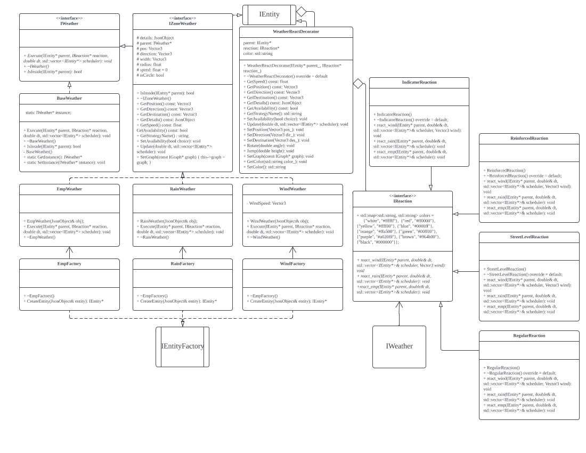

# Team-010-35-homework04

## Usernames

Thea Hiltner - hiltn018

Dat Phan - phanx289

Junsoo Choi - choix712

Niccolo Jensen-Connel - jens1960

## Project details

This project is a simulator designed to simulate drones delivering passengers to different places in the Twin Cities. 

In order to run the project, first navigate to the project directory, and run the command `make -j` to build the code. Do this again if you modify the code. Then, to run the code, run the command `./build/bin/transit_service <port_number> apps/transit_service/web/`, with a port number (usually 8081) instead of `<port_number>`. After that, you can navigate to http://127.0.0.1:<port_number> to see a visualization. You can navigate to http://127.0.0.1:<port_number>/schedule.html to see a page to schedule the trips. You can set the start point and destination by setting 3 different strategies, DFS, Astar, and Dijikstra.

The project simulates what a GPS map used by an uber-like company with self-driving cars would look like. It updates car and customer positions over time as new rides are requested and fulfilled. 

## Our new feature

The original simulation worked completely fine, back when the weather control grids functioned, and before nuclear war became a serious threat to civilization. Our new feature creates weather phenomena, which changes how drones behave - wind impacts their velocity, EMP blasts shut them down, and rain makes them move more slowly. 
Weather phenomena bring the simulation even closer to a real life situation. In reality, anything that moves is affected by the weather to some degree. If it’s windy, anything moving will have its movement adjusted as a result. If it’s raining, any sane driver will slow down. Finally, if an EMP goes off, anything moving as a result of electricity will simply stop.

Our feature adds a random element to the existing project by changing how the drones behave. Weather is an additional variable that can affect drones in real life, so it attempts to make the simulation more realistic. 

In order to implement our design, we had to use multiple design patterns - we had to use the decorator design pattern to add the functionality onto the entities, as well as the strategy design pattern to change how different drones were affected by these weather phenomena. We also had to use the decorator design pattern again to allow for multiple weather phenomena to stack on top of each other, as well as the singleton design pattern to allow for the entities to access the weather. We used the decorator design pattern because it was the easiest way to put multiple weather phenomena into one place and integrate with a singleton. The singleton was used in order to make sure that the weather patterns could be accessed anytime, anywhere. The strategy design pattern was used to allow for a bigger range of behaviors, and to make the drone’s behavior more extensible. 

This new feature isn’t user available; it will simply affect drones in an uncontrollable way. The user can see when a drone is being affected by a weather phenomenon when it changes color - red for rain, blue for EMP, and yellow for wind. If the drone is affected by two or more weather phenomena, the color will shift to account for that as well in a predictable way.

To add some variety we decided to adjust some of the weather effects depending on the movement strategy used. Whenever using the beeline and DFS strategies the drone will be unaffected by wind. Whenever the Dijkstra movement strategy is used, the drone will be less affected by rain and completely unaffected by EMP’s. However, when using the Astar strategy, all weather affects the drone as normal.

## Our Sprint retrospective

Overall, we managed to implement dynamic color changes for drones based on weather. We also created multiple different types of weather phenomena and zones for each, as well as multiple different types of reactions. 

We could make weather phenomena more visible (perhaps on the schedule marker), or change algorithms to accommodate for these weather conditions - potentially, drones could avoid EMP zones or factor the existence of rain into their calculations. However, this isn’t exactly trivial… 

In the next sprint, we will polish our existing features, and allow for weather phenomena to be created dynamically, as well as move, grow, and shrink. Additionally, we could potentially expand our set of weather phenomena and reactions. 

## Our UML Diagram

## External links

Link to docker repository: https://hub.docker.com/repository/docker/stupidityworks/homework-04

Link to video presentation: https://drive.google.com/file/d/1tWiz5jcXL2siRxJf_VaWiozENNtszQN8/view?usp=share_link
